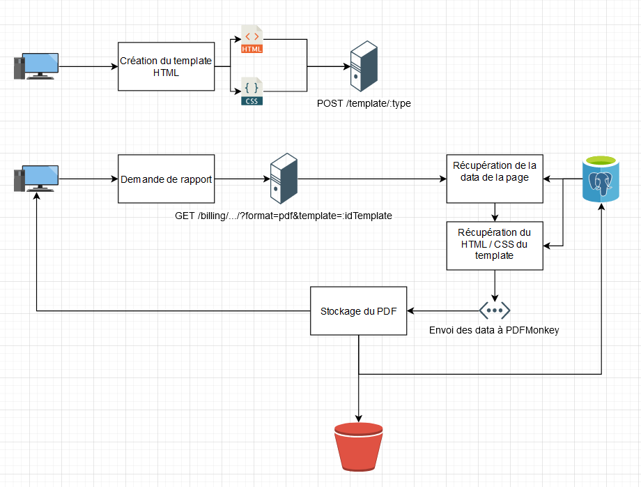

# Solution de Génération de PDFs personnalisés

## User stories

- En tant qu'utilisateur, je peux accéder à un template prédéfini par type, afin de personnaliser ce template
  - Chaque type de document aura un template par défaut
  - Tous les blocs de données seront présents dans le template
- En tant qu'utilisateur, je peux modifier les blocs existants (position, couleur, fond, alignement) dans le template, afin de le personnaliser
  - Modification du CSS en direct
- En tant qu'utilisateur, je peux enregistrer mon template, afin de le réutiliser
  - Versionning du HTML / CSS directement dans la DB
- En tant qu'utilisateur, je peux utiliser mon rapport personnaliser, afin d'avoir un rapport personnalisé
  - Récupération du HTML / CSS dans la base
  - Récupération des données via la route de la page
  - Création du PDF via PDFMonkey
  - Stockage dans le bucket S3
  - Stockage dans la DB

## Architecture

